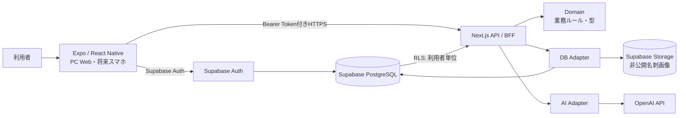
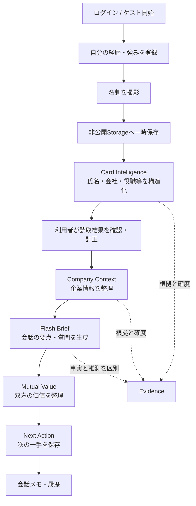
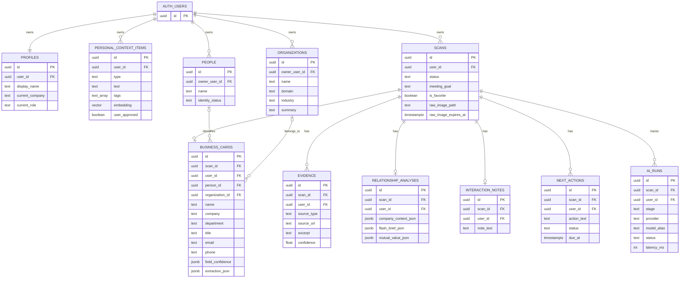

# Miraio Lens アーキテクチャ・データベース概要

- 対象: MVP / ローカルパイロット
- 更新日: 2026-09-16
- 詳細設計: [`ARCHITECTURE.md`](../ARCHITECTURE.md)

## 1. 全体像

Miraio Lens は、MVPの変更しやすさと運用の軽さを優先した
**モジュラーモノリス + 非同期AIパイプライン**です。



### 主な役割

| レイヤー     | 技術                                | 役割                                     |
| ------------ | ----------------------------------- | ---------------------------------------- |
| クライアント | Expo / React Native                 | ログイン、名刺撮影、確認、結果表示、履歴 |
| API / BFF    | Next.js Route Handlers              | 認証確認、処理の進行、AI・DBの呼び出し   |
| 認証         | Supabase Auth                       | メールOTP、ローカル試用時のゲスト認証    |
| データベース | Supabase PostgreSQL                 | 利用者、名刺、分析、次の行動などの永続化 |
| 画像保管     | Supabase Storage                    | 読み取り中の名刺画像を非公開で一時保管   |
| AI           | OpenAI API（差し替え可能なAdapter） | 名刺抽出、企業情報整理、提案生成         |

OpenAI固有の処理は `packages/ai` に閉じ込め、業務上のデータ型は
`packages/domain` に置いています。そのため、将来モデルやAI提供元を変更しても、
アプリ全体を作り直さずに済む構成です。

## 2. 名刺から提案までの流れ

一度の巨大なAI処理にはせず、失敗箇所を特定・再実行しやすい段階処理にしています。



処理状況は `scans.status`、各AI実行は `ai_runs` に記録します。これにより、
途中で失敗しても最初からやり直さず、対象ステージを安全に再試行できます。

## 3. データベース構成



### テーブルの目的

| テーブル                 | 保存する内容                                 |
| ------------------------ | -------------------------------------------- |
| `profiles`               | 利用者の基本プロフィール                     |
| `personal_context_items` | 経歴、専門性、提供できる価値、探しているもの |
| `scans`                  | 1回の名刺交換とAI処理の進行状態              |
| `business_cards`         | 名刺から読み取った構造化データと確度         |
| `people`                 | 同一人物として整理した相手情報               |
| `organizations`          | 相手企業の整理済み情報                       |
| `evidence`               | 事実の根拠、出典、確度                       |
| `relationship_analyses`  | 企業情報、Flash Brief、Mutual Value          |
| `interaction_notes`      | 面談・会話メモ                               |
| `next_actions`           | 次の行動、状態、期限                         |
| `ai_runs`                | AI処理のステージ、成功・失敗、処理時間       |

## 4. セキュリティとプライバシー

- すべての利用者データにSupabase AuthのユーザーIDを紐づけています。
- PostgreSQLのRow Level Security（RLS）により、本人の行だけを読み書きできます。
- ゲスト利用者にも固有のAuth UUIDが発行され、他のゲストとは分離されます。
- 名刺画像のStorageは非公開で、ユーザーID別フォルダへ保存します。
- 名刺画像は読み取り完了後に削除を試み、保持が必要な場合にも有効期限を設定します。
- OpenAI APIキーやSupabaseの特権キーはサーバー側だけに置き、アプリへ含めません。
- API・通常ログへ名刺画像や個人情報を不用意に出さない設計です。
- アカウント削除時は、外部キーのcascadeにより利用者データをまとめて削除します。

## 5. リポジトリ構成

```text
apps/
  mobile/          Expo / React Native UI
  api/             Next.js API / BFF
packages/
  domain/          AIやDBに依存しない業務モデル
  ai/              AIプロバイダー・段階処理・出力スキーマ
  db/              Supabaseへの保存・取得Adapter
  shared/          汎用ユーティリティ
  ui-tokens/       色・余白などのUIトークン
  test-fixtures/   個人情報を含まないテストデータ
supabase/
  migrations/      DBスキーマ・RLS・DB関数
  tests/           RLSなどのDBテスト
docs/               仕様、設計判断、実行計画
evals/              AI品質評価データ
```

## 6. 現在地と今後

現在はローカルPCで試用できるMVPです。モバイルUIもExpo / React Nativeで
構築しているため、同じ業務ロジックを使ってスマホ提供へ進められます。

本番公開前には、クラウド環境へのデプロイ、監視、バックアップ、API利用上限、
公開ゲスト利用の不正対策、プライバシーポリシー等を別途整備します。
